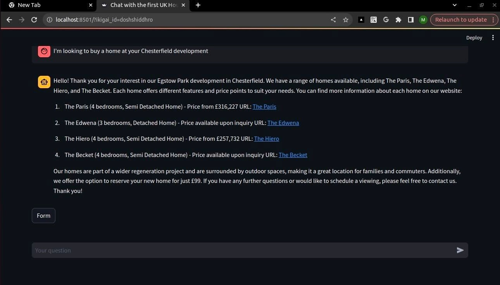
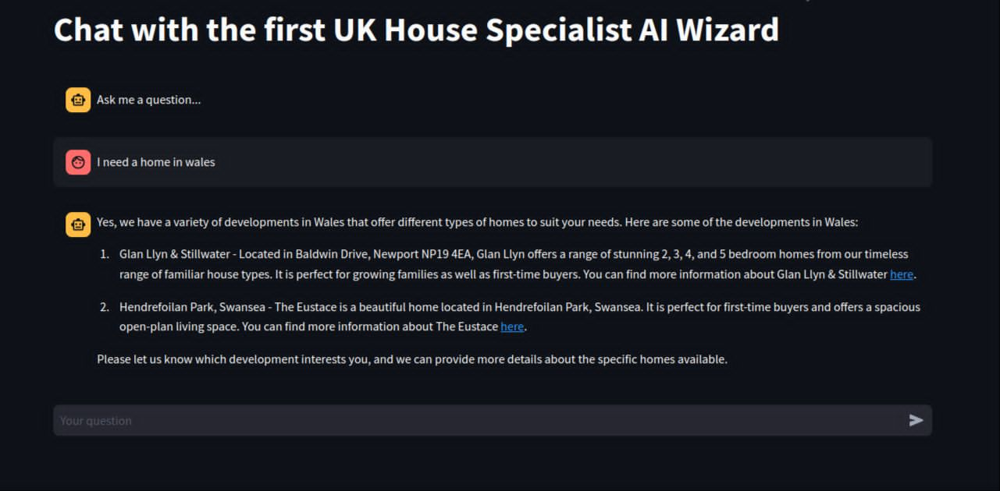

# Realestate Chat Assistant
This is an advanced AI-powered chatbot designed to serve as a personal house hunting assistant. It leverages the capabilities of OpenAI's language models to provide detailed and comprehensive responses to user queries by offering recommendations of houses in a certain development, to users based on their preferences. The chatbot supports multiple languages and integrates with Ikigai's APIs to fetch and process the latest information. It also includes semantic search functionality using Chroma to retrieve the most relevant documents and FAQs. It offers enhanced user interaction by offering accurate, context-aware, and helpful answers, making it a valuable tool for businesses looking to improve their customer support and engagement.





## Usage
### 1. Clone this repository to your local machine.
Start by cloning the GitHub repository containing the Telco Churn Analysis project and the predictive app. You can do this by running the following command in your terminal:
```
https://github.com/KimathiNewton/realestate-chat-assistant.git
```
Navigate to the project directory.
### 2. Setup Virtual Environment
You need Python3 on your system to setup this app. Then you can clone this repo and being at the repo's root :: streamlit sales prediction app> ... follow the steps below:

Windows
```
    python -m venv venv; venv\Scripts\activate; python -m pip install -q --upgrade pip; python -m pip install -qr requirements.txt 
```
Linux & MacOs
```
    python3 -m venv venv; source venv/bin/activate; python -m pip install -q --upgrade pip; python -m pip install -qr requirements.txt  
```
### 3. Install Dependencies:
Install the required Python packages within your virtual environment:
```
pip install -r requirements.txt
```
To run the Application Script

```
streamlit run app.py
```

